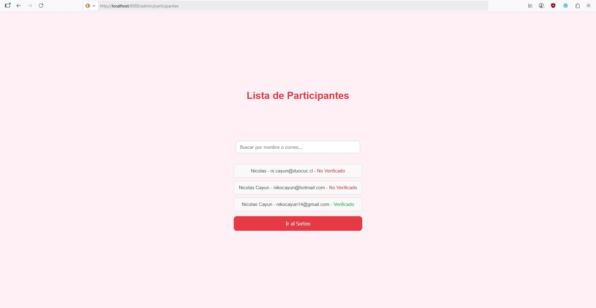

# Prueba técnica CTS Turismo - Sorteo de San Valentín

# 1. Descripción

Este proyecto es una aplicación full stack para gestionar un sorteo.

Sus funcionalidades principales son:

- Registro de participantes con validación por correo.
- Creación de contraseña y verificación de cuenta.
- Login de administrador para gestionar participantes y realizar el sorteo.
- Envío de correos asíncrono mediante Celery + Redis.

# 2. Requerimientos

Para ejecutar correctamente el programa se requiere la instalación
de las siguientes piezas de software.

Backend:

- Python 3.x
- Django 5.x
- Django Rest Framework
- Celery
- Redis

Frontend:

- Node.js
- Vue.js 3.x
- Axios

Otros:

- Correo SMTP. ?

# 3. Instalación

1. Clonar el repositorio:

   En una carpeta, abrir una terminal de Git Bash y ejecutar:

   git clone https://github.com/nicknile0/Prueba-CTS.git

   y luego:

   cd Prueba-CTS

2. Crear y activar entorno virtual:

   En la misma terminal de Git Bash ejecutar:

   python -m venv venv

   y luego:

   source venv/Scripts/activate

   En una terminal cmd sería:

   venv\Scripts\activate.bat

3. Instalar dependencias de backend:

   En la misma terminal de Git Bash ejecutar:

   pip install django djangorestframework celery redis django-environ

4. Instalar dependencias de frontend:

   En la misma terminal de Git Bash ejecutar:

   npm install

Nota: todos los comandos que empiezan con "Python" se deben ejecutar en una terminal que tenga el entorno virtual (venv) activado.

# 4. Configuraciones previas

- En la carpeta raíz del proyecto (Prueba-CTS), crear un archivo llamado
  ".env" sin las comillas. Abrir ese archivo con Bloc de Notas u otro editor de texto. Dentro de ese archivo se debe pegar lo siguiente:

  EMAIL_HOST_USER=sorteotest1@gmail.com
  EMAIL_HOST_PASSWORD=rlyagjymatnyumtx

  Nota: Estas son credenciales reales para una dirección de correo creada con este fin.

- Abrir una terminal cmd o Bash en la carpeta raíz del proyecto y ejecutar:

  python manage.py makemigrations

  y luego:

  python manage.py migrate

- En la misma terminal, crear un superusuario (admin) ejecutando:

  python manage.py createsuperuser

  Nota: Ingresar los campos que exige (nombre, email, etc.).

# 5. Ejecución del programa

    Paso 1: Ejecutar Redis

        En una terminal cmd ejecutar el comando:

        redis-server

        Para probar que Redis está funcionando ejecutar:

        redis-cli ping

        La consola debería responder: PONG

        Nota: También se puede ejecutar el archivo redis-server.exe dentro de la carpeta de instalación de Redis.

    Paso 2: Iniciar backend

        Abrir una terminal cmd o Bash dentro de la carpeta raíz del proyecto, activar el entorno virtual y ejecutar:

        python manage.py runserver

    Paso 3: Ejecutar Celery

        Abrir una terminal cmd o Bash en la carpeta raíz del proyecto y ejecutar:

        celery -A backend worker --loglevel=info --pool=solo

    Paso 4: Iniciar frontend

        Abrir una terminal cmd o Bash en la carpeta /frontend dentro del proyecto y ejecutar:

        npm run serve

# 6. Explicación de funcionamiento

Este programa fue desarrollado usando Django para crear el backend y Vue.js para crear el frontend. Se usa la base de datos por defecto de Django (SQLite) con propósito de pruebas, pero se puede migrar a PostgreSQL en caso de ser necesario escalar los alcances.

El registro de los participantes se lleva a cabo mediante un proceso dividido en dos partes, primero el usuario ingresa a la página de registro, donde debe ingresar su nombre, email, teléfono y hacer clic en el botón "Participar". Esto activa la tarea asíncrona de enviar un correo de verificación a la dirección antes proporcionada.

    Esto ocurre en la URL: "http://localhost:8080/"

    

En el correo de verificación se incluye un enlace que contiene el token necesario para verificar la cuenta. El programa automáticamente obtiene el token cuando el usuario ingresa al enlace. Ahora sólo falta que el usuario cree su contraseña y haga clic en "Activar cuenta" para participar del sorteo.

    Esto ocurre en la URL: "http://localhost:8080/verificar"
    El enlace que llega al correo ya incluye el token, por lo que se verá como esto: "http://localhost:8080/verificar?token=0546eae1-b73c-4e8b-88c12"

    

En cuanto a los administradores, luego de haber creado un superusuario (admin), se debe ingresar a través de la página de login, con su email y su contraseña.

    Esto ocurre en la URL: "http://localhost:8080/admin/login"

    

Después de haber ingresado las credenciales de administrador, se redirige a la página donde está la lista de participantes, aquí se muestra información importante de cada participante, también se puede buscar a un usuario específico con la barra de búsqueda y hay un botón "Ir al sorteo", que redirige a la página del sorteo.

    Esto ocurre en la URL: "http://localhost:8080/admin/participantes"

    

Por último está la página del sorteo que tiene la función de elegir al ganador al azar entre todos los participantes presionando el botón "Elegir ganador" y también se puede volver a la página anterior con el botón "Volver a participantes". Cuando se elige a un ganador, se activa una tarea asíncrona que envía un correo de notificación al participante seleccionado.

    Esto ocurre en la URL: "http://localhost:8080/admin/sorteo"

    

# 7. Endpoints

- '/api/registro/', Método: POST, Registro de participantes.

  Request:

  {
  "nombre": "Juan Pérez",
  "email": "juan@example.com",
  "telefono": "987654321"
  }

  Response:

  {
  "id": 1,
  "nombre": "Juan Pérez",
  "email": "juan@example.com",
  "telefono": "987654321",
  "verificado": false
  }

- '/api/verificar/', Método: POST, Verificación de token + creación de contraseña.

  Request:

  {
  "token": "0546eae1-b73c-4e8b-88c1-23456abcd789",
  "password": "miPassword123"
  }

  Response:

  {
  "detail": "Cuenta verificada correctamente."
  }

- '/api/admin/login/', Método POST, Login de administrador.

  Request:

  {
  "email": "admin@example.com",
  "password": "admin123"
  }

  Response:

  {
  "mensaje": "Bienvenido, Admin",
  "email": "admin@example.com",
  "nombre": "Admin",
  "token": "9c3e3a5f04d44a849b22e88853e2d8f3e0b7d..."
  }

- '/api/admin/participantes/', Método: GET, Lista de participantes (requiere token).

  Response:

  [
  {
  "id": 1,
  "nombre": "Juan Pérez",
  "email": "juan@example.com",
  "telefono": "987654321",
  "verificado": true
  },
  {
  "id": 2,
  "nombre": "María López",
  "email": "maria@example.com",
  "telefono": "123456789",
  "verificado": false
  }
  ]

- '/api/admin/sorteo/', Método: POST, Selecciona al ganador (requiere token).

  Response:

  {
  "mensaje": "Ganador seleccionado",
  "nombre": "Juan Pérez",
  "email": "juan@example.com"
  }
